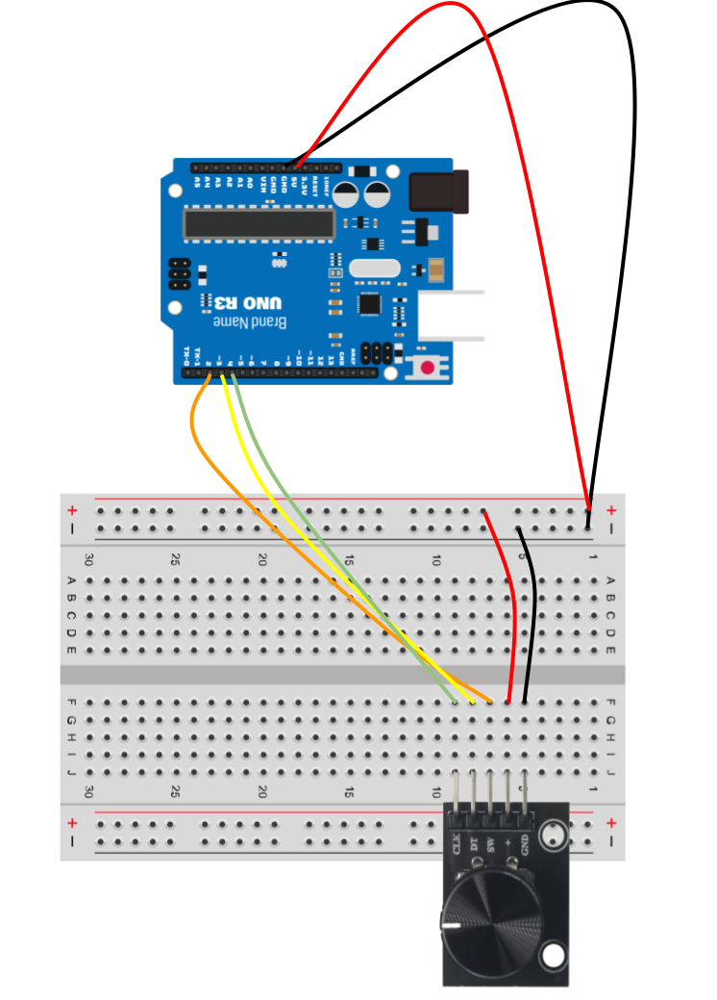

# Python Bridge App for Dual Arduinos

This project demonstrates how to use ProtoPie Connect to interface with two Arduino boards: one for temperature control and another for fan control. The communication is handled via a Python script that bridges ProtoPie Connect and the Arduino boards.

## Project Structure
```plaintext
python-dual-arduinos-bridge-demo/
├── dual-arduinos.py
├── requirements.txt
├── readme.md
└── resources/
    ├── arduino-sketches/
    │   ├── temp_controller.ino
    │   └── fan_controller.ino
    ├── pie/
    │   └── Climate Control - Dual Arduinos.pie
    └── images/
        └── arduino-wiring.png
```
## Setup Instructions

### Requirements

- Python 3.6+
- ProtoPie Connect
- Arduino Uno R3 (2 boards)
- Rotary encoders (2)
- Push buttons (2)
- Breadboard and wires

### Python Setup

1. **Create a virtual environment**:
    ```bash
    python -m venv .venv
    ```

2. **Activate the virtual environment**:
    - On Windows:
        ```bash
        venv\Scripts\activate
        ```
    - On macOS and Linux:
        ```bash
        source .venv/bin/activate
        ```

3. **Install the required Python packages**:
    ```bash
    pip3 install -r requirements.txt
    ```

### Uploading Arduino Sketches

1. **Temperature Controller**:
    - Connect the temperature control hardware to the first Arduino board.
    - Open `temp_controller.ino` in the Arduino IDE.
    - Upload the sketch to the first Arduino board.

2. **Fan Controller**:
    - Connect the fan control hardware to the second Arduino board.
    - Open `fan_controller.ino` in the Arduino IDE.
    - Upload the sketch to the second Arduino board.

### Running the Python Script

1. Connect both Arduino boards to your computer via USB.
2. Ensure ProtoPie Connect is running.
3. Run the Python script:
    ```bash
    python3 dual-arduinos.py
    ```

## Wiring Diagrams



### Temperature Controller

- **Push Button**: Connect to digital pin 2.
- **Rotary Encoder**:
    - **DT**: Connect to digital pin 3.
    - **CLK**: Connect to digital pin 4.
- **Built-in LED**: Controlled via digital pin 13.

### Fan Controller

- **Push Button**: Connect to digital pin 2.
- **Rotary Encoder**:
    - **DT**: Connect to digital pin 3.
    - **CLK**: Connect to digital pin 4.
- **Built-in LED**: Controlled via digital pin 13.

## ProtoPie Setup

1. Open `Climate Control - Dual Arduinos.pie` in ProtoPie Connect.
2. Ensure that you log in to the Enterprise account so that ProtoPie Connect is configured to communicate with the Python script.
3. Launch the pie in a web browser.
4. Interact with the prototype and observe the Arduino boards responding to the commands.

## Troubleshooting

- **No Communication**: Ensure that the correct serial ports and baudrate are specified in the Python script.
- **LED Not Toggling**: Check the wiring and ensure the Arduino sketches are correctly uploaded.
- **ProtoPie Connect Issues**: Verify the configuration and connectivity settings in ProtoPie Connect.

## Contributing

Contributions are welcome! Please fork the repository and submit a pull request with your changes.
