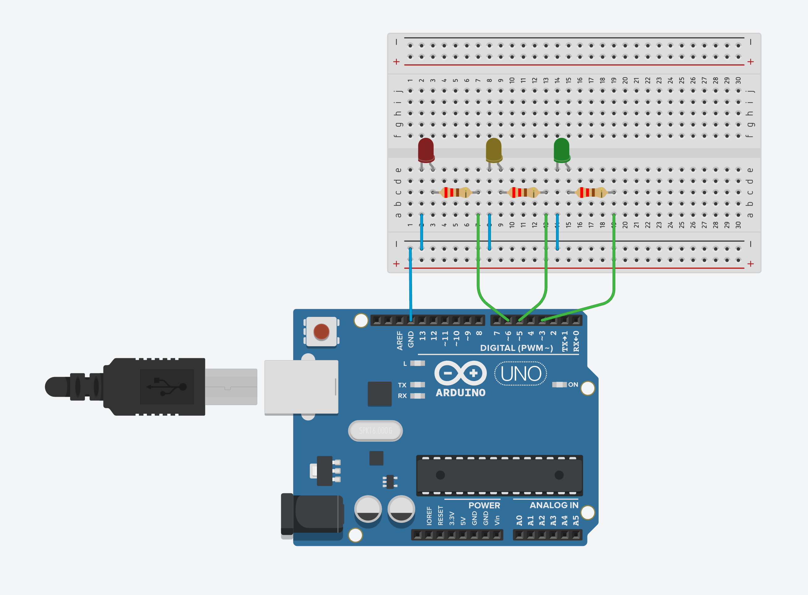

# Connect with media pipe

> This project is Protopie Connect bridge app using Google MediaPipe.

> This app is based NodeJS. You must use NodeJS.

## Installation

```bash
npm install
```

## Start

```bash
npm start
# default mode: finger-pointing

npm run finger-pointing
# run finger pointing mode (./pie/finger_pointing.pie)

npm run brightness-control
# run brightness control mode (./arduino/brightness_control.ino)
```

## Finger Pointing Mode

Demo: https://www.youtube.com/watch?v=PmEk25tfTi8

1. Run Protopie Connect.
2. Run this app. (`npm start` or `npm run finger-pointing`)
3. Access localhost:2918 with your web browser.
4. Allow web browser to use camera.
5. Click the New button in Protopie Connect.
6. Select ./pie/finger_pointing.pie file.
7. Open finger_pointing Pie with web browser or mobile player.
8. Now you can see that the dot tracks your right hand index finger tip.

## Brightness Control Mode

Demo: https://www.youtube.com/watch?v=kHPATFu6F3o

1. Setup Arduino circuit.



**If you don't have an Arduino, you can use pie file(brightness-control.pie) in Protopie Connect**

2. Upload Arduino Code. (./arduino/brightness_control.ino)
3. Run Protopie Connect.
4. Connect Arduino with Protopie Connect.
5. Run this app. (`npm run brightness-control`)
6. Access localhost:2918 with your web browser.
7. Allow web browser to use camera.
8. Make a hand gestures with your right hand like this.


9. Keep gesture and Move your hand up and down
10. Now you can see the brightness of LEDs change by your hand height.

## Reference

- [Protopie](https://www.protopie.io/)
- [Protopie Connect](https://www.protopie.io/learn/docs/connect/getting-started)
- [Google Media Pipe](https://google.github.io/mediapipe/)

## Memo

- [static/local import instead cdn.jsdelivr.net](https://github.com/google/mediapipe/issues/1812)
